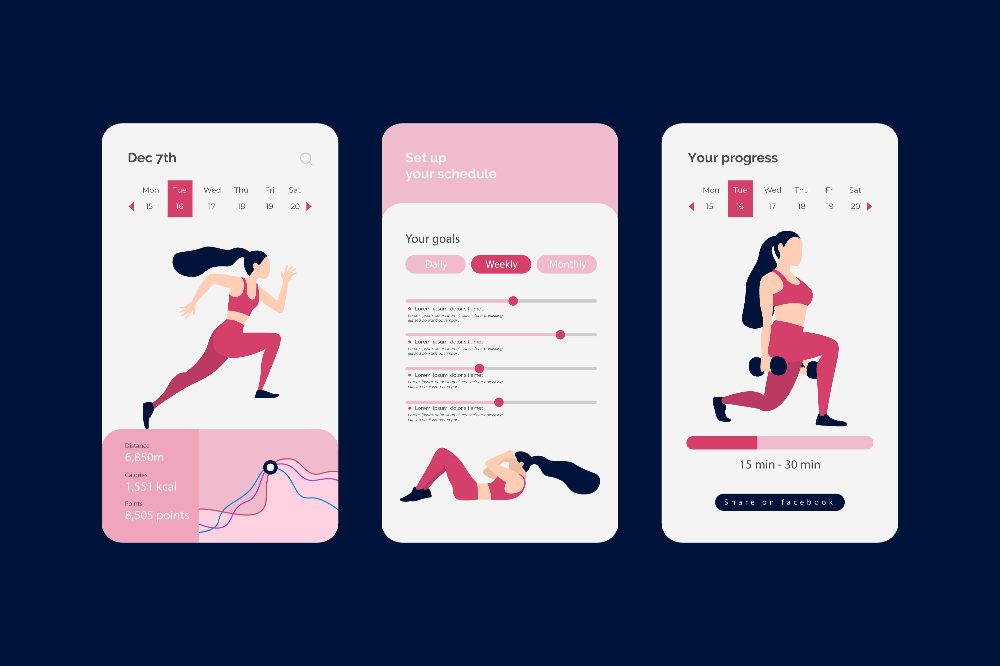

---
hide:
  - navigation
---
# Overview 

### ***Welcome to Our Fitness Tracking App***

Welcome to our state-of-the-art fitness tracking app designed to empower you on your journey to a healthier and fitter lifestyle. Whether you're a seasoned athlete or just starting your fitness journey, our app is here to support you every step of the way.

#### What We Offer

Our app is more than just a workout companion; it's a holistic fitness solution tailored to your needs. With intuitive features and a user-friendly interface, you can seamlessly integrate fitness and wellness into your daily routine. From tracking workouts and managing nutrition to setting achievable goals, we've got you covered.

<figure markdown>
  { width="600" }
  <figcaption>Image by Freepik</figcaption>
</figure>

#### Key Features

- Effortless Workout Tracking: Log your workouts with ease, whether it's a brisk morning run, a challenging weightlifting session, or a relaxing yoga class. Keep a comprehensive record of your activities and monitor your progress over time.

- Comprehensive Exercise Database: Explore a vast library of exercises complete with step-by-step instructions, images, and videos. No matter your fitness level, you'll find exercises that suit your goals and preferences.

- Nutrition Made Simple: Take control of your nutrition by logging meals and monitoring your calorie intake. Discover the world of macronutrients and learn how to fuel your body for optimal performance.

- Personalized Insights: Set goals, track milestones, and gain valuable insights into your fitness journey. Our app adapts to your progress and provides recommendations to keep you motivated and on track.

#### Get Started

Ready to embark on your fitness adventure? Our Getting Started guide will walk you through installation, account setup, and introduce you to the app's interface. Whether you're on a computer or a mobile device, we've got installation guides for all platforms.

We're excited to have you join our fitness community. Together, we'll work towards achieving your fitness aspirations and enjoying a healthier life. Let's make every step count!

Stay active, stay motivated,
The Pulse Pro Team